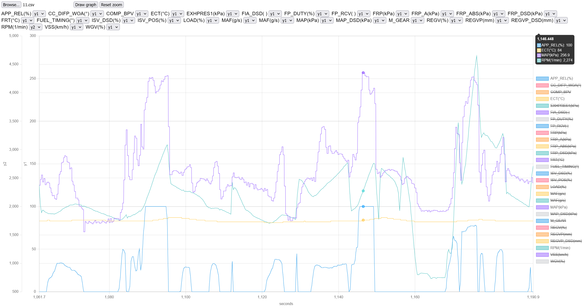

# FORScan datalog plotter

This is a quick and dirty FORScan CSV datalog chart plotter meant to replace the awful built-in oscilloscope visualizer.

## Usage

1. `npm install`
1. `npm run start`
1. Open http://localhost:5173/
1. Load a CSV datalog
1. Change axis dropdown to group parameters on different Y axes
1. Click `Draw graph`
1. Zoom and pan freely, reset with `Reset zoom`
